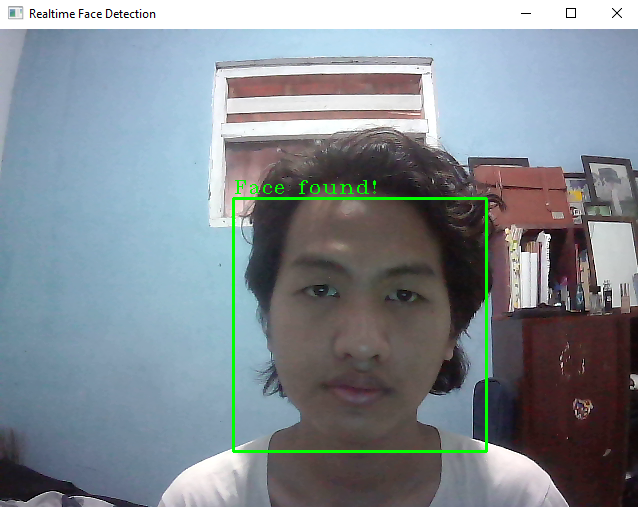
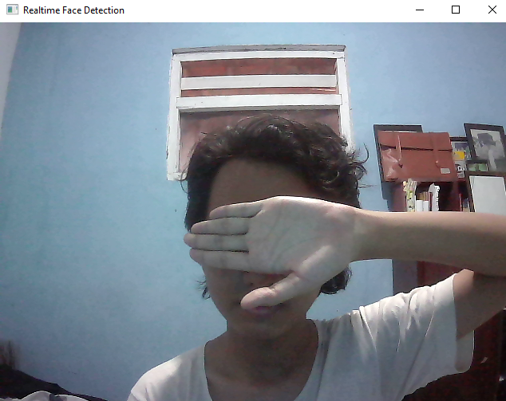

# Real-time Face Detection using Python

## CS50
This is my final project for CS50 course.

## Video Demo
https://youtu.be/3VQv5iknseo

## Description
Introducing my face detection program, a tool designed to effortlessly detect faces in real-time. Utilizing a combination of advanced algorithms and deep learning techniques, this program boasts remarkable accuracy in identifying and locating faces within live camera feeds. Upon detecting a face, the program intelligently applies image processing techniques to highlight the identified face, placing a border around it. This visual representation aids in easily recognizing and distinguishing faces. With just a few lines of code, users can effortlessly incorporate this face detection functionality into their own projects or applications.

## What For?
For security and surveillances. Face detection apps play a crucial role in security and surveillance systems. They can identify known individuals or detect potential threats by matching faces against watchlists or databases.

Biometric identification. Face detection apps can be used for biometric authentication and identification purposes, such as unlocking devices, accessing secure areas, or verifying individual identities.

Photography and social media. Face detection apps enhance photography and social media platforms by automatically detecting and tagging people in photos, suggesting filters or effects, and providing a personalized user experience.

Accessibility and Assistive Technology: Face detection can be used in assistive technologies to enable facial gestures as input commands, allowing individuals with physical disabilities to interact with devices or control their environment.

## What Can Be Improved?
Features (A lot of features)
You can improve this program to make a more specified uses. You can add a biometric identification for security uses, or you can manipulate the image to make the person face more attractive for social media uses, and many more. Unfortunately, the program I made didn’t do all of that. It’s just the bare bone.

## How Did I Got This Far?
All thanks to this code

```python
  face_classifier = cv2.CascadeClassifier(cv2.data.haarcascades + "haarcascade_frontalface_default.xml")
```

Object Detection using Haar feature-based cascade classifiers is an effective object detection method proposed by Paul Viola and Michael Jones in their paper, "Rapid Object Detection using a Boosted Cascade of Simple Features" in 2001. It is a machine learning based approach where a cascade function is trained from a lot of positive and negative images. It is then used to detect objects in other images.

OpenCV provides a training method or pretrained models that are located in the data folder in the OpenCV installation.

### Set the minimal size to detect faces and putting a border around the faces

```python
  #Set the minimal size to detect any faces
      faces = face_classifier.detectMultiScale(grayscale, 1.1, 5, minSize=(40, 40))
      for (x, y, w, h) in faces:
          #Set the border around the faces
          cv2.rectangle(vid, (x, y), (x + w, y + h), (0, 255, 0), 2)
          #Put the "Face found!" text above the square
          cv2.putText(vid, "Face found!", (x, y - 5), cv2.FONT_HERSHEY_COMPLEX_SMALL, 1, (0, 255, 0), 1)
      return faces
```

### And then finally you apply all of these function

```python
  #Apply the function to create a border around face
  faces = detect_bounding_box(video_frame)
```


## Demo pictures
The program works perfectly and flawlessly detect any faces as shown
| Face Shown | Face Covered |
| :--------: | :----------: |
|   | |

## Documentation
https://docs.opencv.org/3.4/db/d28/tutorial_cascade_classifier.html

https://docs.opencv.org/3.4/da/d60/tutorial_face_main.html

https://www.datacamp.com/tutorial/face-detection-python-opencv

#### Thank you for everything, CS50.